<div align="center">

# 🚀 F2F.icu

**简单、快速、安全的点对点文件传输工具**

[English](./README_EN.md) | 简体中文

[](https://github.com/isnl/f2f/stargazers)
[](https://github.com/isnl/f2f/network)
[](https://github.com/isnl/f2f/issues)
[](https://github.com/isnl/f2f/blob/main/LICENSE)
[](https://github.com/isnl/f2f/pulls)

[](https://pages.cloudflare.com/)
[](https://workers.cloudflare.com/)

[🌐 在线体验](https://f2f.icu) | [📖 文档](https://github.com/isnl/f2f) | [🐛 报告问题](https://github.com/isnl/f2f/issues) | [💡 功能建议](https://github.com/isnl/f2f/issues/new)

</div>

---

## ✨ 特性

<table>
  <tr>
    <td align="center">🚀</td>
    <td><b>极速传输</b><br/>基于 Cloudflare 全球边缘网络，毫秒级响应</td>
    <td align="center">🔐</td>
    <td><b>6位分享码</b><br/>简单易记，21.8亿种组合保证安全</td>
  </tr>
  <tr>
    <td align="center">📦</td>
    <td><b>大文件支持</b><br/>单文件最大支持 25MB，满足日常需求</td>
    <td align="center">📝</td>
    <td><b>多种格式</b><br/>支持文件、文本、图片等多种内容类型</td>
  </tr>
  <tr>
    <td align="center">⏱️</td>
    <td><b>自动销毁</b><br/>下载后 1 分钟自动删除，保护隐私</td>
    <td align="center">🆓</td>
    <td><b>完全免费</b><br/>基于 Cloudflare 免费服务，无需绑卡</td>
  </tr>
  <tr>
    <td align="center">🎨</td>
    <td><b>精美界面</b><br/>现代化 UI 设计，极致用户体验</td>
    <td align="center">📱</td>
    <td><b>响应式设计</b><br/>完美支持手机、平板、桌面端</td>
  </tr>
</table>

## 🎯 在线演示

👉 **访问：[https://f2f.icu](https://f2f.icu)**

<div align="center">
  
</div>

## 📸 预览

<details>
<summary>点击查看界面截图</summary>

### 发送界面


### 接收界面


</details>

## 🛠️ 技术栈

<div align="center">

| 技术 | 说明 |
|------|------|
| ⚡️ **Cloudflare Pages** | 前端静态网站托管，全球 CDN 加速 |
| 🔥 **Cloudflare Workers** | Serverless 后端 API，边缘计算 |
| 💾 **Cloudflare KV** | 键值存储，原生 TTL 支持 |
| 🎨 **Tailwind CSS** | 现代化 CSS 框架，快速构建界面 |
| 📝 **TypeScript** | 类型安全的 JavaScript 超集 |

</div>

## 🚀 快速开始

### 前置要求

- ✅ Node.js 16+
- ✅ Cloudflare 账号（免费版即可）
- ✅ Git

### 一键部署

#### 方法一：Fork 并部署（推荐）

1. **Fork 本仓库**
   
   点击右上角的 `Fork` 按钮

2. **连接 Cloudflare Pages**
   
   - 登录 [Cloudflare Dashboard](https://dash.cloudflare.com/)
   - 进入 `Workers & Pages` → `Create application` → `Pages` → `Connect to Git`
   - 选择你 Fork 的仓库
   - 构建配置：
     - **构建命令**：留空（或 `npm run build`）
     - **输出目录**：`public`
   - 点击 `Save and Deploy`

3. **配置 KV 存储**
   
   - 在 Dashboard 中进入 `Workers & Pages` → `KV`
   - 点击 `Create a namespace`，命名为 `f2f-transfers`
   - 回到你的 Pages 项目 → `Settings` → `Functions` → `KV namespace bindings`
   - 添加绑定：
     - **变量名**：`TRANSFERS`
     - **KV 命名空间**：选择 `f2f-transfers`
   - 保存并重新部署

4. **完成！🎉**
   
   访问 Cloudflare 提供的域名即可使用

#### 方法二：本地开发

```bash
# 克隆仓库
git clone https://github.com/isnl/f2f.git
cd f2f

# 安装依赖
npm install

# 创建 KV 命名空间
wrangler kv:namespace create "TRANSFERS"

# 配置 wrangler.toml
# 将生成的 namespace ID 填入 wrangler.toml

# 启动本地开发服务器
npm run dev

# 访问 http://localhost:8788
```

### 配置文件说明

编辑 `wrangler.toml`：

```toml
name = "f2f-transfer"
compatibility_date = "2025-11-20"

pages_build_output_dir = "public"

[[kv_namespaces]]
binding = "TRANSFERS"
id = "your_kv_namespace_id_here"          # 替换为你的生产环境 KV ID
preview_id = "your_preview_kv_id_here"    # 替换为你的预览环境 KV ID
```

## 📖 使用指南

### 📤 发送文件/文本

1. 切换到**发送**标签
2. 输入或生成 6 位分享码（支持大写字母 A-Z 和数字 0-9）
3. 选择内容类型：
   - **文件**：点击上传或拖拽文件（≤25MB）
   - **文本**：直接输入文本内容
   - **图片**：选择图片或 Ctrl/Cmd + V 粘贴截图
4. 点击**创建分享**
5. 复制分享码或分享链接发送给接收方

### 📥 接收文件/文本

1. 切换到**接收**标签
2. 输入 6 位取件码
3. 点击**获取内容**
4. 文件自动下载，文本/图片直接显示
5. ⚠️ 内容将在 **1 分钟后自动删除**，请及时保存

## ⚙️ 工作原理

```mermaid
graph LR
    A[发送方上传] --> B[转换为 Base64]
    B --> C[存储到 KV]
    C --> D[生成分享码]
    D --> E[接收方输入码]
    E --> F[从 KV 读取]
    F --> G[标记已下载]
    G --> H[设置 1 分钟 TTL]
    H --> I[自动删除]
```



### 数据流程

1. **上传阶段**
   - 文件 → Base64 编码 → 存储到 KV
   - 默认 TTL：1 小时（未下载 1 小时后自动删除）

2. **下载阶段**
   - 验证分享码 → 读取数据
   - 标记为已下载 → 更新 TTL 为 1 分钟
   - 自动触发浏览器下载（文件）或显示（文本/图片）

3. **清理阶段**
   - KV 自动根据 TTL 删除过期数据
   - 无需手动清理，零维护成本

### 为什么选择 KV 存储？

| 特性 | KV 存储 | R2 对象存储 | D1 数据库 |
|------|---------|-------------|-----------|
| 单值大小 | **25MB** ✅ | 5GB | 1MB（需分片） |
| TTL 支持 | **原生支持** ✅ | ❌ 需手动实现 | ❌ 需手动实现 |
| 读写延迟 | **极低** ✅ | 低 | 较低 |
| 免费额度 | **100K 读/天** ✅ | 需绑卡 | 10个库 |
| 适用场景 | **临时文件存储** ✅ | 大文件存储 | 结构化数据 |

## 🔒 安全说明

| 项目 | 说明 |
|------|------|
| 🔢 **分享码强度** | 6 位字符（A-Z, 0-9），共 36^6 ≈ 21.8 亿种组合 |
| ⏰ **数据保留** | 未下载：1 小时 / 已下载：1 分钟 |
| ⚠️ **隐私提醒** | 不建议传输敏感信息（如密码、身份证等） |
| 🔐 **传输安全** | 全程 HTTPS 加密传输 |

## 📊 限制说明

- **文件大小**：单文件最大 25MB
- **分享码格式**：6 位大写字母或数字（A-Z, 0-9）
- **数据保留时间**：
  - 未下载：1 小时后自动删除
  - 已下载：1 分钟后自动删除
- **KV 免费额度**：
  - 每天 100,000 次读取
  - 每天 1,000 次写入
  - 对个人使用完全够用

## 📝 API 文档

### POST `/api/upload`

上传文件或文本

**请求参数（FormData）：**

```typescript
{
  code: string,       // 6位分享码（必填）
  type: 'file' | 'text',  // 内容类型（必填）
  content: string,    // Base64 编码的文件内容或文本（必填）
  fileName?: string   // 文件名（type=file 时必填）
}
```

**响应：**

```typescript
{
  success: true,
  code: string,       // 分享码
  message: string     // 提示信息
}
```

### GET `/api/download`

下载文件或获取文本

**请求参数：**

```
?code=ABC123  // 6位取件码
```

**响应：**

```typescript
{
  success: true,
  type: 'file' | 'text',
  content: string,      // Base64 或文本内容
  contentType: string,  // MIME 类型
  fileName?: string     // 文件名（type=file 时返回）
}
```

## 🎨 自定义配置

### 修改文件大小限制

编辑 `functions/api/upload.ts`：

```typescript
const maxSize = 25 * 1024 * 1024; // 修改为你想要的大小（字节）
```

### 修改数据保留时间

**上传时的 TTL**（未下载状态）：

```typescript
// functions/api/upload.ts
expirationTtl: 3600 // 1小时 = 3600秒，可自定义
```

**下载后的 TTL**（已下载状态）：

```typescript
// functions/api/download.ts
expirationTtl: 60 // 1分钟 = 60秒，可自定义
```

## 🚀 性能优化

### 前端优化

- ✅ Tailwind CSS 按需加载
- ✅ 图标懒加载（Lucide Icons）
- ✅ 响应式图片预览
- ✅ 防抖和节流处理

### 后端优化

- ✅ 边缘计算（Cloudflare Workers）
- ✅ 全球 CDN 加速
- ✅ KV 存储低延迟读写

### 建议

1. 启用 Cloudflare 的 Brotli 压缩
2. 配置自定义域名并启用 HTTPS
3. 启用 Cloudflare Analytics 监控流量
4. 使用 Cloudflare Workers Analytics 监控 API 性能

## 🤝 贡献指南

我们欢迎所有形式的贡献！🎉

### 如何贡献

1. **Fork 本仓库**
2. **创建特性分支** (`git checkout -b feature/AmazingFeature`)
3. **提交改动** (`git commit -m 'Add some AmazingFeature'`)
4. **推送到分支** (`git push origin feature/AmazingFeature`)
5. **提交 Pull Request**

### 贡献类型

- 🐛 报告 Bug
- 💡 提出新功能建议
- 📖 改进文档
- 🎨 优化 UI/UX
- ⚡️ 性能优化
- 🌍 多语言支持

### 开发规范

- 遵循 TypeScript 规范
- 保持代码简洁易读
- 添加必要的注释
- 提交前测试功能

## 🌟 致谢

感谢以下技术和项目：

- [Cloudflare Pages](https://pages.cloudflare.com/) - 静态网站托管
- [Cloudflare Workers](https://workers.cloudflare.com/) - Serverless 计算平台
- [Tailwind CSS](https://tailwindcss.com/) - CSS 框架
- [Lucide Icons](https://lucide.dev/) - 开源图标库

## 📄 许可证

本项目采用 [MIT](LICENSE) 许可证 - 详见 LICENSE 文件

## 💬 联系方式

- 🐛 **报告问题**：[GitHub Issues](https://github.com/isnl/f2f/issues)
- 💡 **功能建议**：[GitHub Discussions](https://github.com/isnl/f2f/discussions)
- 📧 **邮件联系**：[通过 GitHub](https://github.com/isnl)

## ❓ 常见问题

<details>
<summary><b>为什么不用 R2 对象存储？</b></summary>

R2 对象存储需要绑定银行卡才能使用，而 KV 存储完全免费且开箱即用。对于 25MB 以内的临时文件传输，KV 存储完全够用，且延迟更低。
</details>

<details>
<summary><b>如何修改文件大小限制？</b></summary>

修改 `functions/api/upload.ts` 中的 `maxSize` 常量即可。但请注意：
- KV 单值最大限制为 25MB
- 超过 25MB 需要使用 R2 对象存储
- 文件越大，上传和下载时间越长
</details>

<details>
<summary><b>数据真的安全吗？</b></summary>

- ✅ 所有数据存储在 Cloudflare 边缘节点，物理安全有保障
- ✅ 全程 HTTPS 加密传输
- ✅ 自动删除机制保护隐私
- ⚠️ 但 6 位分享码存在被猜测的极小概率
- ⚠️ 建议不要传输高度敏感信息（如密码、私钥等）
</details>

<details>
<summary><b>为什么下载后是 1 分钟删除而不是立即删除？</b></summary>

给用户一定的容错时间：
- 避免网络延迟导致下载失败
- 允许用户重新下载一次
- 1 分钟后自动删除，平衡了便利性和安全性

你可以在代码中自定义这个时间。
</details>

<details>
<summary><b>免费额度够用吗？</b></summary>

对于个人使用绰绰有余：
- **KV 读取**：每天 100,000 次
- **KV 写入**：每天 1,000 次
- **Workers 请求**：每天 100,000 次

如果是团队或高频使用，可能需要升级到付费版本。
</details>

<details>
<summary><b>可以自建部署吗？</b></summary>

完全可以！本项目开源，你可以：
1. Fork 本仓库
2. 部署到自己的 Cloudflare 账号
3. 自定义域名和配置
4. 完全掌控数据和服务
</details>

<details>
<summary><b>支持批量上传吗？</b></summary>

当前版本不支持批量上传，但你可以：
- 将多个文件打包成 ZIP 后上传
- 或者参考贡献指南，提交 PR 添加批量上传功能
</details>

<details>
<summary><b>如何查看使用统计？</b></summary>

在 Cloudflare Dashboard 中可以查看：
- **Workers Analytics**：API 调用次数、响应时间等
- **KV Metrics**：读写次数、存储使用量等
- **Pages Analytics**：访问量、地理分布等
</details>

---

## 📊 项目统计

<div align="center">


</div>

## ⭐ Star 历史

<div align="center">

[](https://star-history.com/#isnl/f2f&Date)

</div>

---

<div align="center">

### 🌟 如果这个项目对你有帮助，请给个 Star 吧！

**Made with ❤️ by [isnl](https://github.com/isnl)**

[⬆ 回到顶部](#-f2ficu)

</div>
