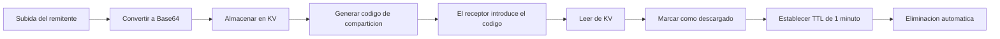

<div align="center">

# 🚀 F2F.icu

**Herramienta de transferencia de archivos P2P simple, rapida y segura**

[English](./README.md) | [简体中文](./README_ZH.md) | [日本語](./README_JA.md) | [한국어](./README_KO.md) | [Français](./README_FR.md) | Español | [Deutsch](./README_DE.md)

[](https://github.com/isnl/f2f/stargazers)
[](https://github.com/isnl/f2f/network)
[](https://github.com/isnl/f2f/issues)
[](https://github.com/isnl/f2f/blob/main/LICENSE)
[](https://github.com/isnl/f2f/pulls)

[](https://pages.cloudflare.com/)
[](https://workers.cloudflare.com/)

[🌐 Demo en vivo](https://f2f.icu) | [📖 Documentacion](https://github.com/isnl/f2f) | [🐛 Reportar problemas](https://github.com/isnl/f2f/issues) | [💡 Sugerencias](https://github.com/isnl/f2f/issues/new)

</div>

---

## ✨ Caracteristicas

<table>
  <tr>
    <td align="center">🚀</td>
    <td><b>Transferencia ultrarapida</b><br/>Impulsada por la red global edge de Cloudflare con tiempos de respuesta en milisegundos</td>
    <td align="center">🔐</td>
    <td><b>Codigo de 6 digitos</b><br/>Simple y facil de recordar, con 2.180 millones de combinaciones para mayor seguridad</td>
  </tr>
  <tr>
    <td align="center">📦</td>
    <td><b>Soporte de archivos grandes</b><br/>Archivo individual de hasta 25MB, perfecto para las necesidades cotidianas</td>
    <td align="center">📝</td>
    <td><b>Multiples formatos</b><br/>Soporte para archivos, texto, imagenes y diversos tipos de contenido</td>
  </tr>
  <tr>
    <td align="center">📚</td>
    <td><b>Carga por lotes</b><br/>Soporte para multiples archivos (hasta 100) e imagenes (hasta 25) a la vez</td>
    <td align="center">📦</td>
    <td><b>Descarga ZIP</b><br/>Descarga multiples archivos/imagenes como un unico paquete ZIP</td>
  </tr>
  <tr>
    <td align="center">⏱️</td>
    <td><b>Eliminacion automatica</b><br/>Se elimina automaticamente 1 minuto despues de la descarga para proteger la privacidad</td>
    <td align="center">🆓</td>
    <td><b>Completamente gratuito</b><br/>Basado en el plan gratuito de Cloudflare, sin necesidad de tarjeta de credito</td>
  </tr>
  <tr>
    <td align="center">🎨</td>
    <td><b>Interfaz hermosa</b><br/>Diseno de interfaz moderno con una experiencia de usuario excepcional</td>
    <td align="center">📱</td>
    <td><b>Diseno responsive</b><br/>Soporte perfecto para movil, tablet y escritorio</td>
  </tr>
</table>

## 🎯 Demo en vivo

👉 **Visita: [https://f2f.icu](https://f2f.icu)**

<div align="center">
  
</div>

## 📸 Vista previa

<details>
<summary>Haz clic para ver capturas de pantalla de la interfaz</summary>

### Interfaz de envio


### Interfaz de recepcion


</details>

## 🛠️ Stack tecnologico

<div align="center">

| Tecnologia | Descripcion |
|------------|-------------|
| ⚡️ **Cloudflare Pages** | Alojamiento de sitios web estaticos con aceleracion CDN global |
| 🔥 **Cloudflare Workers** | API backend serverless con computacion en el edge |
| 💾 **Cloudflare KV** | Almacenamiento clave-valor con soporte nativo de TTL |
| 🎨 **Tailwind CSS** | Framework CSS moderno para desarrollo rapido de interfaces |
| 📝 **TypeScript** | Superset de JavaScript con tipado seguro |

</div>

## 🚀 Inicio rapido

### Requisitos previos

- ✅ Node.js 16+
- ✅ Cuenta de Cloudflare (el plan gratuito es suficiente)
- ✅ Git

### Despliegue con un clic

#### Metodo 1: Fork y despliegue (Recomendado)

1. **Haz fork de este repositorio**

   Haz clic en el boton `Fork` en la esquina superior derecha

2. **Conectar con Cloudflare Pages**

   - Inicia sesion en [Cloudflare Dashboard](https://dash.cloudflare.com/)
   - Ve a `Workers & Pages` → `Create application` → `Pages` → `Connect to Git`
   - Selecciona tu repositorio forkeado
   - Configuracion de compilacion:
     - **Build command**: Dejar en blanco (o `npm run build`)
     - **Output directory**: `public`
   - Haz clic en `Save and Deploy`

3. **Configurar almacenamiento KV**

   - En el Dashboard, ve a `Workers & Pages` → `KV`
   - Haz clic en `Create a namespace`, nombralo `f2f-transfers`
   - Vuelve a tu proyecto Pages → `Settings` → `Functions` → `KV namespace bindings`
   - Agrega el binding:
     - **Variable name**: `TRANSFERS`
     - **KV namespace**: Selecciona `f2f-transfers`
   - Guarda y vuelve a desplegar

4. **¡Listo! 🎉**

   Visita el dominio proporcionado por Cloudflare

#### Metodo 2: Desarrollo local

```bash
# Clonar repositorio
git clone https://github.com/isnl/f2f.git
cd f2f

# Instalar dependencias
npm install

# Crear namespace KV
wrangler kv:namespace create "TRANSFERS"

# Configurar wrangler.toml
# Agrega el ID del namespace generado a wrangler.toml

# Iniciar servidor de desarrollo local
npm run dev

# Visitar http://localhost:8788
```

### Archivo de configuracion

Edita `wrangler.toml`:

```toml
name = "f2f-transfer"
compatibility_date = "2025-11-20"

pages_build_output_dir = "public"

[[kv_namespaces]]
binding = "TRANSFERS"
id = "your_kv_namespace_id_here"          # Reemplaza con tu ID de KV de produccion
preview_id = "your_preview_kv_id_here"    # Reemplaza con tu ID de KV de vista previa
```

## 📖 Guia de uso

### 📤 Enviar archivos/texto

1. Cambia a la pestana **Enviar**
2. Introduce o genera un codigo de comparticion de 6 digitos (admite letras mayusculas A-Z y numeros 0-9)
3. Selecciona el tipo de contenido:
   - **Archivo**: Haz clic para subir o arrastra y suelta (admite multiples archivos, hasta 100, total ≤25MB)
   - **Texto**: Introduce el contenido de texto directamente
   - **Imagen**: Selecciona una imagen o Ctrl/Cmd + V para pegar captura de pantalla (admite multiples imagenes, hasta 25)
4. Haz clic en **Crear comparticion**
5. Copia el codigo o enlace de comparticion y envialo al destinatario

### 📥 Recibir archivos/texto

1. Cambia a la pestana **Recibir**
2. Introduce el codigo de recogida de 6 digitos
3. Haz clic en **Obtener contenido**
4. Opciones de descarga:
   - **Archivo unico**: Descarga automatica
   - **Multiples archivos/imagenes**: Elige descargar individualmente o como un paquete ZIP
   - **Texto/Imagen**: Vista previa directa
5. ⚠️ El contenido se **eliminara automaticamente despues de 1 minuto**, por favor guardalo rapidamente

## ⚙️ Como funciona



### Flujo de datos

1. **Fase de subida**
   - Archivo → Codificacion Base64 → Almacenar en KV
   - TTL predeterminado: 1 hora (se elimina automaticamente despues de 1 hora si no se descarga)

2. **Fase de descarga**
   - Verificar codigo de comparticion → Leer datos
   - Marcar como descargado → Actualizar TTL a 1 minuto
   - Activar automaticamente la descarga del navegador (archivos) o mostrar (texto/imagenes)

3. **Fase de limpieza**
   - KV elimina automaticamente los datos expirados segun el TTL
   - Costo de mantenimiento cero

### ¿Por que elegir almacenamiento KV?

| Caracteristica | Almacenamiento KV | Almacenamiento de objetos R2 | Base de datos D1 |
|----------------|-------------------|------------------------------|------------------|
| Tamano maximo por valor | **25MB** ✅ | 5GB | 1MB (requiere fragmentacion) |
| Soporte TTL | **Nativo** ✅ | ❌ Implementacion manual | ❌ Implementacion manual |
| Latencia de lectura/escritura | **Muy baja** ✅ | Baja | Mas baja |
| Plan gratuito | **100K lecturas/dia** ✅ | Requiere tarjeta de credito | 10 bases de datos |
| Caso de uso | **Almacenamiento temporal de archivos** ✅ | Almacenamiento de archivos grandes | Datos estructurados |

## 🔒 Seguridad

| Elemento | Descripcion |
|----------|-------------|
| 🔢 **Fortaleza del codigo** | 6 caracteres (A-Z, 0-9), ~2.180 millones de combinaciones |
| ⏰ **Retencion de datos** | Sin descargar: 1 hora / Descargado: 1 minuto |
| ⚠️ **Aviso de privacidad** | No recomendado para informacion sensible (contrasenas, documentos de identidad, etc.) |
| 🔐 **Seguridad de transferencia** | Cifrado HTTPS completo |

## 📊 Limitaciones

- **Tamano de archivo**: Maximo 25MB en total
- **Cantidad de archivos**: Hasta 100 archivos o 25 imagenes por transferencia
- **Formato del codigo de comparticion**: 6 digitos en letras mayusculas o numeros (A-Z, 0-9)
- **Retencion de datos**:
  - Sin descargar: Eliminacion automatica despues de 1 hora
  - Descargado: Eliminacion automatica despues de 1 minuto
- **Plan gratuito de KV**:
  - 100.000 lecturas por dia
  - 1.000 escrituras por dia
  - Suficiente para uso personal

## 📝 Documentacion API

### POST `/api/upload`

Subir archivo o texto

**Parametros de solicitud (FormData):**

```typescript
{
  code: string,       // Codigo de comparticion de 6 digitos (obligatorio)
  type: 'file' | 'text' | 'files' | 'images',  // Tipo de contenido (obligatorio)
  content: string,    // Contenido (obligatorio)
                      // - file: Contenido del archivo codificado en Base64
                      // - text: Contenido de texto plano
                      // - files: Array JSON [{dataUrl, name, size, type}, ...]
                      // - images: Array JSON [{dataUrl, name}, ...]
  fileName?: string   // Nombre del archivo (obligatorio cuando type=file)
}
```

**Respuesta:**

```typescript
{
  success: true,
  code: string,       // Codigo de comparticion
  message: string     // Mensaje de estado
}
```

### GET `/api/download`

Descargar archivo u obtener texto

**Parametros de solicitud:**

```
?code=ABC123  // Codigo de recogida de 6 digitos
```

**Respuesta:**

```typescript
{
  success: true,
  type: 'file' | 'text' | 'files' | 'images',
  content: string,      // Base64, texto o array JSON
  contentType: string,  // Tipo MIME
  fileName?: string     // Nombre del archivo (se devuelve cuando type=file)
}
```

## 🎨 Personalizacion

### Modificar limite de tamano de archivo

Edita `functions/api/upload.ts`:

```typescript
const maxSize = 25 * 1024 * 1024; // Modifica al tamano deseado (bytes)
```

### Modificar tiempo de retencion de datos

**TTL de subida** (sin descargar):

```typescript
// functions/api/upload.ts
expirationTtl: 3600 // 1 hora = 3600 segundos, personalizable
```

**TTL de descarga** (descargado):

```typescript
// functions/api/download.ts
expirationTtl: 60 // 1 minuto = 60 segundos, personalizable
```

## 🚀 Optimizacion del rendimiento

### Optimizacion del frontend

- ✅ Carga bajo demanda de Tailwind CSS
- ✅ Carga diferida de iconos (Lucide Icons)
- ✅ Vista previa de imagenes responsive
- ✅ Debouncing y throttling

### Optimizacion del backend

- ✅ Computacion en el edge (Cloudflare Workers)
- ✅ Aceleracion CDN global
- ✅ Almacenamiento KV de baja latencia

### Recomendaciones

1. Habilitar la compresion Brotli de Cloudflare
2. Configurar un dominio personalizado con HTTPS
3. Habilitar Cloudflare Analytics para monitorear el trafico
4. Usar Cloudflare Workers Analytics para monitorear el rendimiento de la API

## 🤝 Contribuir

¡Damos la bienvenida a todo tipo de contribuciones! 🎉

### Como contribuir

1. **Haz fork de este repositorio**
2. **Crea una rama de funcionalidad** (`git checkout -b feature/FuncionalidadIncreible`)
3. **Haz commit de los cambios** (`git commit -m 'Agregar FuncionalidadIncreible'`)
4. **Sube la rama** (`git push origin feature/FuncionalidadIncreible`)
5. **Envia un Pull Request**

### Tipos de contribuciones

- 🐛 Reportar errores
- 💡 Sugerir nuevas funcionalidades
- 📖 Mejorar la documentacion
- 🎨 Optimizar UI/UX
- ⚡️ Optimizacion del rendimiento
- 🌍 Soporte multiidioma

### Directrices de desarrollo

- Seguir las convenciones de TypeScript
- Mantener el codigo limpio y legible
- Agregar los comentarios necesarios
- Probar las funcionalidades antes de enviar

## 🌟 Agradecimientos

Gracias a las siguientes tecnologias y proyectos:

- [Cloudflare Pages](https://pages.cloudflare.com/) - Alojamiento de sitios web estaticos
- [Cloudflare Workers](https://workers.cloudflare.com/) - Plataforma de computacion serverless
- [Tailwind CSS](https://tailwindcss.com/) - Framework CSS
- [Lucide Icons](https://lucide.dev/) - Biblioteca de iconos de codigo abierto

## 📄 Licencia

Este proyecto esta bajo la licencia [MIT](LICENSE) - consulta el archivo LICENSE para mas detalles

## 💬 Contacto

- 🐛 **Reportar problemas**: [GitHub Issues](https://github.com/isnl/f2f/issues)
- 💡 **Sugerencias de funcionalidades**: [GitHub Discussions](https://github.com/isnl/f2f/discussions)
- 📧 **Contacto por correo**: [Via GitHub](https://github.com/isnl)

## ❓ Preguntas frecuentes

<details>
<summary><b>¿Por que no usar almacenamiento de objetos R2?</b></summary>

El almacenamiento de objetos R2 requiere vincular una tarjeta de credito, mientras que el almacenamiento KV es completamente gratuito y esta listo para usar. Para transferencias temporales de archivos menores a 25MB, el almacenamiento KV es suficiente y ofrece una latencia mas baja.
</details>

<details>
<summary><b>¿Como modificar el limite de tamano de archivo?</b></summary>

Modifica la constante `maxSize` en `functions/api/upload.ts`. Ten en cuenta:
- El valor maximo individual de KV es de 25MB
- Los archivos mayores de 25MB requieren almacenamiento de objetos R2
- Los archivos mas grandes tardan mas en subirse/descargarse
</details>

<details>
<summary><b>¿Los datos son realmente seguros?</b></summary>

- ✅ Todos los datos se almacenan en nodos edge de Cloudflare con seguridad fisica
- ✅ Transferencia completamente cifrada con HTTPS
- ✅ El mecanismo de eliminacion automatica protege la privacidad
- ⚠️ Pequena probabilidad de que el codigo de 6 digitos sea adivinado
- ⚠️ No recomendado para informacion altamente sensible (contrasenas, claves privadas, etc.)
</details>

<details>
<summary><b>¿Por que la eliminacion es 1 minuto despues de la descarga en lugar de inmediata?</b></summary>

Proporciona un tiempo de tolerancia a errores para los usuarios:
- Evita fallos de descarga debido a la latencia de red
- Permite a los usuarios volver a descargar una vez
- La eliminacion automatica de 1 minuto equilibra conveniencia y seguridad

Puedes personalizar este tiempo en el codigo.
</details>

<details>
<summary><b>¿Es suficiente el plan gratuito?</b></summary>

Mas que suficiente para uso personal:
- **Lecturas KV**: 100.000 por dia
- **Escrituras KV**: 1.000 por dia
- **Solicitudes Workers**: 100.000 por dia

Para equipos o uso de alta frecuencia, puede ser necesario actualizar a un plan de pago.
</details>

<details>
<summary><b>¿Puedo alojarlo yo mismo?</b></summary>

¡Por supuesto! Este proyecto es de codigo abierto, puedes:
1. Hacer fork de este repositorio
2. Desplegarlo en tu propia cuenta de Cloudflare
3. Personalizar el dominio y la configuracion
4. Tener control total sobre los datos y el servicio
</details>

<details>
<summary><b>¿Admite carga por lotes?</b></summary>

✅ **¡Si!** La version actual admite carga por lotes:
- **Multiples archivos**: Hasta 100 archivos, tamano total sin exceder 25MB
- **Multiples imagenes**: Hasta 25 imagenes, tamano total sin exceder 25MB
- **Opciones de descarga**: Descarga individual o como un unico paquete ZIP
</details>

<details>
<summary><b>¿Como ver las estadisticas de uso?</b></summary>

En el Cloudflare Dashboard puedes ver:
- **Workers Analytics**: Cantidad de llamadas a la API, tiempo de respuesta, etc.
- **KV Metrics**: Cantidad de lecturas/escrituras, uso de almacenamiento, etc.
- **Pages Analytics**: Trafico, distribucion geografica, etc.
</details>

---


## ⭐ Historial de Stars

<div align="center">

[](https://star-history.com/#isnl/f2f&Date)

</div>

---

<div align="center">

### 🌟 ¡Si este proyecto te ayuda, dale una Star!

**Made with ❤️ by [isnl](https://github.com/isnl)**

[⬆ Volver arriba](#-f2ficu)

</div>
