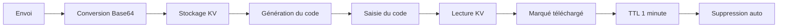

<div align="center">

# 🚀 F2F.icu

**Outil de transfert de fichiers pair-à-pair simple, rapide et sécurisé**

[English](./README.md) | [简体中文](./README_ZH.md) | [日本語](./README_JA.md) | [한국어](./README_KO.md) | Français | [Español](./README_ES.md) | [Deutsch](./README_DE.md)

[](https://github.com/isnl/f2f/stargazers)
[](https://github.com/isnl/f2f/network)
[](https://github.com/isnl/f2f/issues)
[](https://github.com/isnl/f2f/blob/main/LICENSE)
[](https://github.com/isnl/f2f/pulls)

[](https://pages.cloudflare.com/)
[](https://workers.cloudflare.com/)

[🌐 Démo en ligne](https://f2f.icu) | [📖 Documentation](https://github.com/isnl/f2f) | [🐛 Signaler un problème](https://github.com/isnl/f2f/issues) | [💡 Suggestions](https://github.com/isnl/f2f/issues/new)

</div>

---

## ✨ Fonctionnalités

<table>
  <tr>
    <td align="center">🚀</td>
    <td><b>Transfert ultra-rapide</b><br/>Propulsé par le réseau edge mondial de Cloudflare avec des temps de réponse en millisecondes</td>
    <td align="center">🔐</td>
    <td><b>Code de partage à 6 chiffres</b><br/>Simple et mémorable, avec 2,18 milliards de combinaisons pour la sécurité</td>
  </tr>
  <tr>
    <td align="center">📦</td>
    <td><b>Support de gros fichiers</b><br/>Fichier unique jusqu'à 25 Mo, parfait pour les besoins quotidiens</td>
    <td align="center">📝</td>
    <td><b>Formats multiples</b><br/>Prise en charge des fichiers, textes, images et divers types de contenu</td>
  </tr>
  <tr>
    <td align="center">📚</td>
    <td><b>Téléversement par lot</b><br/>Prise en charge de plusieurs fichiers (jusqu'à 100) et images (jusqu'à 25) en une seule fois</td>
    <td align="center">📦</td>
    <td><b>Téléchargement ZIP</b><br/>Téléchargez plusieurs fichiers/images sous forme d'un seul package ZIP</td>
  </tr>
  <tr>
    <td align="center">⏱️</td>
    <td><b>Suppression automatique</b><br/>Supprimé automatiquement 1 minute après le téléchargement pour protéger la vie privée</td>
    <td align="center">🆓</td>
    <td><b>Entièrement gratuit</b><br/>Basé sur le forfait gratuit de Cloudflare, aucune carte bancaire requise</td>
  </tr>
  <tr>
    <td align="center">🎨</td>
    <td><b>Belle interface</b><br/>Design d'interface moderne avec une expérience utilisateur exceptionnelle</td>
    <td align="center">📱</td>
    <td><b>Design responsive</b><br/>Prise en charge parfaite des mobiles, tablettes et ordinateurs</td>
  </tr>
</table>

## 🎯 Démo en ligne

👉 **Visitez : [https://f2f.icu](https://f2f.icu)**

<div align="center">
  
</div>

## 📸 Aperçu

<details>
<summary>Cliquez pour voir les captures d'écran de l'interface</summary>

### Interface d'envoi


### Interface de réception


</details>

## 🛠️ Stack technique

<div align="center">

| Technologie | Description |
|-------------|-------------|
| ⚡️ **Cloudflare Pages** | Hébergement de site statique frontend avec accélération CDN mondiale |
| 🔥 **Cloudflare Workers** | API backend serverless avec edge computing |
| 💾 **Cloudflare KV** | Stockage clé-valeur avec prise en charge native du TTL |
| 🎨 **Tailwind CSS** | Framework CSS moderne pour un développement rapide de l'interface |
| 📝 **TypeScript** | Sur-ensemble typé de JavaScript |

</div>

## 🚀 Démarrage rapide

### Prérequis

- ✅ Node.js 16+
- ✅ Compte Cloudflare (le forfait gratuit suffit)
- ✅ Git

### Déploiement en un clic

#### Méthode 1 : Fork et déploiement (Recommandé)

1. **Forkez ce dépôt**

   Cliquez sur le bouton `Fork` en haut à droite

2. **Connectez-le à Cloudflare Pages**

   - Connectez-vous au [Tableau de bord Cloudflare](https://dash.cloudflare.com/)
   - Allez dans `Workers & Pages` → `Create application` → `Pages` → `Connect to Git`
   - Sélectionnez votre dépôt forké
   - Configuration du build :
     - **Build command** : Laisser vide (ou `npm run build`)
     - **Output directory** : `public`
   - Cliquez sur `Save and Deploy`

3. **Configurez le stockage KV**

   - Dans le tableau de bord, allez dans `Workers & Pages` → `KV`
   - Cliquez sur `Create a namespace`, nommez-le `f2f-transfers`
   - Retournez dans votre projet Pages → `Settings` → `Functions` → `KV namespace bindings`
   - Ajoutez un binding :
     - **Variable name** : `TRANSFERS`
     - **KV namespace** : Sélectionnez `f2f-transfers`
   - Sauvegardez et redéployez

4. **Terminé ! 🎉**

   Visitez le domaine fourni par Cloudflare

#### Méthode 2 : Développement local

```bash
# Cloner le dépôt
git clone https://github.com/isnl/f2f.git
cd f2f

# Installer les dépendances
npm install

# Créer le namespace KV
wrangler kv:namespace create "TRANSFERS"

# Configurer wrangler.toml
# Ajoutez l'ID du namespace généré dans wrangler.toml

# Démarrer le serveur de développement local
npm run dev

# Visitez http://localhost:8788
```

### Fichier de configuration

Éditez `wrangler.toml` :

```toml
name = "f2f-transfer"
compatibility_date = "2025-11-20"

pages_build_output_dir = "public"

[[kv_namespaces]]
binding = "TRANSFERS"
id = "your_kv_namespace_id_here"          # Remplacez par votre ID KV de production
preview_id = "your_preview_kv_id_here"    # Remplacez par votre ID KV de prévisualisation
```

## 📖 Guide d'utilisation

### 📤 Envoyer des fichiers/texte

1. Passez à l'onglet **Envoyer**
2. Saisissez ou générez un code de partage à 6 chiffres (prend en charge les lettres majuscules A-Z et les chiffres 0-9)
3. Sélectionnez le type de contenu :
   - **Fichier** : Cliquez pour téléverser ou glissez-déposez (prend en charge plusieurs fichiers, jusqu'à 100, total ≤25 Mo)
   - **Texte** : Saisissez le contenu textuel directement
   - **Image** : Sélectionnez une image ou Ctrl/Cmd + V pour coller une capture d'écran (prend en charge plusieurs images, jusqu'à 25)
4. Cliquez sur **Créer le partage**
5. Copiez le code de partage ou le lien et envoyez-le au destinataire

### 📥 Recevoir des fichiers/texte

1. Passez à l'onglet **Recevoir**
2. Saisissez le code de récupération à 6 chiffres
3. Cliquez sur **Obtenir le contenu**
4. Options de téléchargement :
   - **Fichier unique** : Téléchargement automatique
   - **Plusieurs fichiers/images** : Choisissez de télécharger individuellement ou sous forme de package ZIP
   - **Texte/Image** : Affichage en aperçu direct
5. ⚠️ Le contenu sera **automatiquement supprimé après 1 minute**, veuillez le sauvegarder rapidement

## ⚙️ Fonctionnement



### Flux de données

1. **Phase d'envoi**
   - Fichier → Encodage Base64 → Stockage dans KV
   - TTL par défaut : 1 heure (suppression automatique après 1 heure si non téléchargé)

2. **Phase de téléchargement**
   - Vérification du code de partage → Lecture des données
   - Marqué comme téléchargé → Mise à jour du TTL à 1 minute
   - Déclenchement automatique du téléchargement navigateur (fichiers) ou affichage (texte/images)

3. **Phase de nettoyage**
   - KV supprime automatiquement les données expirées selon le TTL
   - Coût de maintenance nul

### Pourquoi choisir le stockage KV ?

| Caractéristique | Stockage KV | Stockage objet R2 | Base de données D1 |
|-----------------|-------------|-------------------|---------------------|
| Taille max. par valeur | **25 Mo** ✅ | 5 Go | 1 Mo (nécessite un fractionnement) |
| Support TTL | **Natif** ✅ | ❌ Implémentation manuelle | ❌ Implémentation manuelle |
| Latence lecture/écriture | **Très faible** ✅ | Faible | Plus faible |
| Forfait gratuit | **100K lectures/jour** ✅ | Nécessite une carte bancaire | 10 bases de données |
| Cas d'utilisation | **Stockage temporaire de fichiers** ✅ | Stockage de gros fichiers | Données structurées |

## 🔒 Sécurité

| Élément | Description |
|---------|-------------|
| 🔢 **Force du code** | 6 caractères (A-Z, 0-9), ~2,18 milliards de combinaisons |
| ⏰ **Conservation des données** | Non téléchargé : 1 heure / Téléchargé : 1 minute |
| ⚠️ **Avis de confidentialité** | Non recommandé pour les informations sensibles (mots de passe, pièces d'identité, etc.) |
| 🔐 **Sécurité du transfert** | Chiffrement HTTPS intégral |

## 📊 Limitations

- **Taille des fichiers** : Maximum 25 Mo au total
- **Nombre de fichiers** : Jusqu'à 100 fichiers ou 25 images par transfert
- **Format du code de partage** : 6 caractères en lettres majuscules ou chiffres (A-Z, 0-9)
- **Conservation des données** :
  - Non téléchargé : Suppression automatique après 1 heure
  - Téléchargé : Suppression automatique après 1 minute
- **Forfait gratuit KV** :
  - 100 000 lectures par jour
  - 1 000 écritures par jour
  - Suffisant pour un usage personnel

## 📝 Documentation API

### POST `/api/upload`

Téléverser un fichier ou du texte

**Paramètres de la requête (FormData) :**

```typescript
{
  code: string,       // Code de partage à 6 chiffres (obligatoire)
  type: 'file' | 'text' | 'files' | 'images',  // Type de contenu (obligatoire)
  content: string,    // Contenu (obligatoire)
                      // - file : Contenu du fichier encodé en Base64
                      // - text : Contenu en texte brut
                      // - files : Tableau JSON [{dataUrl, name, size, type}, ...]
                      // - images : Tableau JSON [{dataUrl, name}, ...]
  fileName?: string   // Nom du fichier (obligatoire quand type=file)
}
```

**Réponse :**

```typescript
{
  success: true,
  code: string,       // Code de partage
  message: string     // Message de statut
}
```

### GET `/api/download`

Télécharger un fichier ou obtenir du texte

**Paramètres de la requête :**

```
?code=ABC123  // Code de récupération à 6 chiffres
```

**Réponse :**

```typescript
{
  success: true,
  type: 'file' | 'text' | 'files' | 'images',
  content: string,      // Base64, texte ou tableau JSON
  contentType: string,  // Type MIME
  fileName?: string     // Nom du fichier (retourné quand type=file)
}
```

## 🎨 Personnalisation

### Modifier la limite de taille des fichiers

Éditez `functions/api/upload.ts` :

```typescript
const maxSize = 25 * 1024 * 1024; // Modifiez selon la taille souhaitée (en octets)
```

### Modifier la durée de rétention des données

**TTL de téléversement** (non téléchargé) :

```typescript
// functions/api/upload.ts
expirationTtl: 3600 // 1 heure = 3600 secondes, personnalisable
```

**TTL de téléchargement** (téléchargé) :

```typescript
// functions/api/download.ts
expirationTtl: 60 // 1 minute = 60 secondes, personnalisable
```

## 🚀 Optimisation des performances

### Optimisation frontend

- ✅ Chargement à la demande de Tailwind CSS
- ✅ Chargement différé des icônes (Lucide Icons)
- ✅ Aperçu d'images responsive
- ✅ Debouncing et throttling

### Optimisation backend

- ✅ Edge computing (Cloudflare Workers)
- ✅ Accélération CDN mondiale
- ✅ Stockage KV à faible latence

### Recommandations

1. Activez la compression Brotli de Cloudflare
2. Configurez un domaine personnalisé avec HTTPS
3. Activez Cloudflare Analytics pour surveiller le trafic
4. Utilisez Cloudflare Workers Analytics pour surveiller les performances de l'API

## 🤝 Contribution

Nous accueillons toutes les formes de contributions ! 🎉

### Comment contribuer

1. **Forkez ce dépôt**
2. **Créez une branche de fonctionnalité** (`git checkout -b feature/SuperFonctionnalite`)
3. **Validez vos modifications** (`git commit -m 'Add some SuperFonctionnalite'`)
4. **Poussez vers la branche** (`git push origin feature/SuperFonctionnalite`)
5. **Soumettez une Pull Request**

### Types de contributions

- 🐛 Signaler des bugs
- 💡 Suggérer de nouvelles fonctionnalités
- 📖 Améliorer la documentation
- 🎨 Optimiser l'UI/UX
- ⚡️ Optimisation des performances
- 🌍 Support multilingue

### Directives de développement

- Suivez les conventions TypeScript
- Gardez le code propre et lisible
- Ajoutez les commentaires nécessaires
- Testez les fonctionnalités avant de soumettre

## 🌟 Remerciements

Merci aux technologies et projets suivants :

- [Cloudflare Pages](https://pages.cloudflare.com/) - Hébergement de site statique
- [Cloudflare Workers](https://workers.cloudflare.com/) - Plateforme de calcul serverless
- [Tailwind CSS](https://tailwindcss.com/) - Framework CSS
- [Lucide Icons](https://lucide.dev/) - Bibliothèque d'icônes open source

## 📄 Licence

Ce projet est sous licence [MIT](LICENSE) - consultez le fichier LICENSE pour plus de détails

## 💬 Contact

- 🐛 **Signaler des problèmes** : [GitHub Issues](https://github.com/isnl/f2f/issues)
- 💡 **Suggestions de fonctionnalités** : [GitHub Discussions](https://github.com/isnl/f2f/discussions)
- 📧 **Contact par e-mail** : [Via GitHub](https://github.com/isnl)

## ❓ FAQ

<details>
<summary><b>Pourquoi ne pas utiliser le stockage objet R2 ?</b></summary>

Le stockage objet R2 nécessite l'association d'une carte bancaire, tandis que le stockage KV est entièrement gratuit et prêt à l'emploi. Pour les transferts temporaires de fichiers de moins de 25 Mo, le stockage KV est suffisant avec une latence plus faible.
</details>

<details>
<summary><b>Comment modifier la limite de taille des fichiers ?</b></summary>

Modifiez la constante `maxSize` dans `functions/api/upload.ts`. Remarques :
- La taille maximale d'une valeur KV est de 25 Mo
- Les fichiers de plus de 25 Mo nécessitent le stockage objet R2
- Les fichiers plus volumineux prennent plus de temps à téléverser/télécharger
</details>

<details>
<summary><b>Les données sont-elles vraiment sécurisées ?</b></summary>

- ✅ Toutes les données sont stockées sur les nœuds edge de Cloudflare avec sécurité physique
- ✅ Transfert entièrement chiffré en HTTPS
- ✅ Le mécanisme de suppression automatique protège la vie privée
- ⚠️ Faible probabilité que le code à 6 chiffres soit deviné
- ⚠️ Non recommandé pour les informations hautement sensibles (mots de passe, clés privées, etc.)
</details>

<details>
<summary><b>Pourquoi une suppression après 1 minute plutôt qu'immédiate après le téléchargement ?</b></summary>

Cela offre un temps de tolérance aux erreurs pour les utilisateurs :
- Évite les échecs de téléchargement dus à la latence réseau
- Permet aux utilisateurs de re-télécharger une fois
- La suppression automatique après 1 minute équilibre commodité et sécurité

Vous pouvez personnaliser cette durée dans le code.
</details>

<details>
<summary><b>Le forfait gratuit est-il suffisant ?</b></summary>

Amplement suffisant pour un usage personnel :
- **Lectures KV** : 100 000 par jour
- **Écritures KV** : 1 000 par jour
- **Requêtes Workers** : 100 000 par jour

Pour les équipes ou une utilisation à haute fréquence, il peut être nécessaire de passer à un forfait payant.
</details>

<details>
<summary><b>Puis-je l'auto-héberger ?</b></summary>

Absolument ! Ce projet est open source, vous pouvez :
1. Forker ce dépôt
2. Déployer sur votre propre compte Cloudflare
3. Personnaliser le domaine et la configuration
4. Avoir un contrôle total sur les données et le service
</details>

<details>
<summary><b>Le téléversement par lot est-il pris en charge ?</b></summary>

✅ **Oui !** La version actuelle prend en charge le téléversement par lot :
- **Plusieurs fichiers** : Jusqu'à 100 fichiers, taille totale ne dépassant pas 25 Mo
- **Plusieurs images** : Jusqu'à 25 images, taille totale ne dépassant pas 25 Mo
- **Options de téléchargement** : Télécharger individuellement ou sous forme d'un seul package ZIP
</details>

<details>
<summary><b>Comment consulter les statistiques d'utilisation ?</b></summary>

Dans le tableau de bord Cloudflare, vous pouvez consulter :
- **Workers Analytics** : Nombre d'appels API, temps de réponse, etc.
- **KV Metrics** : Nombre de lectures/écritures, utilisation du stockage, etc.
- **Pages Analytics** : Trafic, distribution géographique, etc.
</details>

---


## ⭐ Historique des Stars

<div align="center">

[](https://star-history.com/#isnl/f2f&Date)

</div>

---

<div align="center">

### 🌟 Si ce projet vous aide, n'hésitez pas à lui donner une Star !

**Made with ❤️ by [isnl](https://github.com/isnl)**

[⬆ Retour en haut](#-f2ficu)

</div>
