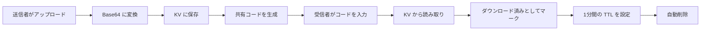

<div align="center">

# 🚀 F2F.icu

**シンプル、高速、安全なピアツーピアファイル転送ツール**

[English](./README.md) | [简体中文](./README_ZH.md) | 日本語 | [한국어](./README_KO.md) | [Français](./README_FR.md) | [Español](./README_ES.md) | [Deutsch](./README_DE.md)

[](https://github.com/isnl/f2f/stargazers)
[](https://github.com/isnl/f2f/network)
[](https://github.com/isnl/f2f/issues)
[](https://github.com/isnl/f2f/blob/main/LICENSE)
[](https://github.com/isnl/f2f/pulls)

[](https://pages.cloudflare.com/)
[](https://workers.cloudflare.com/)

[🌐 ライブデモ](https://f2f.icu) | [📖 ドキュメント](https://github.com/isnl/f2f) | [🐛 バグ報告](https://github.com/isnl/f2f/issues) | [💡 機能リクエスト](https://github.com/isnl/f2f/issues/new)

</div>

---

## ✨ 特徴

<table>
  <tr>
    <td align="center">🚀</td>
    <td><b>超高速転送</b><br/>Cloudflare のグローバルエッジネットワークによるミリ秒レベルの応答</td>
    <td align="center">🔐</td>
    <td><b>6桁の共有コード</b><br/>シンプルで覚えやすく、21.8億通りの組み合わせで安全性を確保</td>
  </tr>
  <tr>
    <td align="center">📦</td>
    <td><b>大容量ファイル対応</b><br/>1ファイル最大25MB、日常的なニーズに最適</td>
    <td align="center">📝</td>
    <td><b>多種フォーマット対応</b><br/>ファイル、テキスト、画像など様々なコンテンツタイプをサポート</td>
  </tr>
  <tr>
    <td align="center">📚</td>
    <td><b>一括アップロード</b><br/>複数ファイル（最大100個）や複数画像（最大25枚）の同時アップロードに対応</td>
    <td align="center">📦</td>
    <td><b>ZIP ダウンロード</b><br/>複数ファイル/画像をまとめて ZIP パッケージとしてダウンロード</td>
  </tr>
  <tr>
    <td align="center">⏱️</td>
    <td><b>自動削除</b><br/>ダウンロード後1分で自動削除、プライバシーを保護</td>
    <td align="center">🆓</td>
    <td><b>完全無料</b><br/>Cloudflare の無料プランベース、クレジットカード不要</td>
  </tr>
  <tr>
    <td align="center">🎨</td>
    <td><b>美しいインターフェース</b><br/>モダンな UI デザインと優れたユーザー体験</td>
    <td align="center">📱</td>
    <td><b>レスポンシブデザイン</b><br/>スマートフォン、タブレット、デスクトップに完全対応</td>
  </tr>
</table>

## 🎯 ライブデモ

👉 **アクセス：[https://f2f.icu](https://f2f.icu)**

<div align="center">
  
</div>

## 📸 プレビュー

<details>
<summary>クリックしてスクリーンショットを表示</summary>

### 送信画面


### 受信画面


</details>

## 🛠️ 技術スタック

<div align="center">

| 技術 | 説明 |
|------|------|
| ⚡️ **Cloudflare Pages** | フロントエンド静的サイトホスティング、グローバル CDN 高速配信 |
| 🔥 **Cloudflare Workers** | Serverless バックエンド API、エッジコンピューティング |
| 💾 **Cloudflare KV** | キーバリューストレージ、ネイティブ TTL サポート |
| 🎨 **Tailwind CSS** | モダン CSS フレームワーク、迅速な UI 開発 |
| 📝 **TypeScript** | 型安全な JavaScript スーパーセット |

</div>

## 🚀 クイックスタート

### 前提条件

- ✅ Node.js 16+
- ✅ Cloudflare アカウント（無料プランで十分）
- ✅ Git

### ワンクリックデプロイ

#### 方法1：Fork してデプロイ（推奨）

1. **このリポジトリを Fork**

   右上の `Fork` ボタンをクリック

2. **Cloudflare Pages に接続**

   - [Cloudflare Dashboard](https://dash.cloudflare.com/) にログイン
   - `Workers & Pages` → `Create application` → `Pages` → `Connect to Git` に進む
   - Fork したリポジトリを選択
   - ビルド設定：
     - **ビルドコマンド**：空欄のまま（または `npm run build`）
     - **出力ディレクトリ**：`public`
   - `Save and Deploy` をクリック

3. **KV ストレージの設定**

   - Dashboard で `Workers & Pages` → `KV` に進む
   - `Create a namespace` をクリックし、`f2f-transfers` と名前を付ける
   - Pages プロジェクトに戻り → `Settings` → `Functions` → `KV namespace bindings`
   - バインディングを追加：
     - **変数名**：`TRANSFERS`
     - **KV ネームスペース**：`f2f-transfers` を選択
   - 保存して再デプロイ

4. **完了！🎉**

   Cloudflare が提供するドメインにアクセスして利用開始

#### 方法2：ローカル開発

```bash
# リポジトリをクローン
git clone https://github.com/isnl/f2f.git
cd f2f

# 依存パッケージをインストール
npm install

# KV ネームスペースを作成
wrangler kv:namespace create "TRANSFERS"

# wrangler.toml を設定
# 生成されたネームスペース ID を wrangler.toml に記入

# ローカル開発サーバーを起動
npm run dev

# http://localhost:8788 にアクセス
```

### 設定ファイル

`wrangler.toml` を編集：

```toml
name = "f2f-transfer"
compatibility_date = "2025-11-20"

pages_build_output_dir = "public"

[[kv_namespaces]]
binding = "TRANSFERS"
id = "your_kv_namespace_id_here"          # 本番環境の KV ID に置き換えてください
preview_id = "your_preview_kv_id_here"    # プレビュー環境の KV ID に置き換えてください
```

## 📖 使い方ガイド

### 📤 ファイル/テキストの送信

1. **送信** タブに切り替え
2. 6桁の共有コードを入力または生成（大文字 A-Z と数字 0-9 に対応）
3. コンテンツタイプを選択：
   - **ファイル**：クリックしてアップロードまたはドラッグ＆ドロップ（複数ファイル対応、最大100個、合計25MB以下）
   - **テキスト**：テキスト内容を直接入力
   - **画像**：画像を選択、または Ctrl/Cmd + V でスクリーンショットを貼り付け（複数画像対応、最大25枚）
4. **共有を作成** をクリック
5. 共有コードまたはリンクをコピーして受信者に送信

### 📥 ファイル/テキストの受信

1. **受信** タブに切り替え
2. 6桁の受取コードを入力
3. **コンテンツを取得** をクリック
4. ダウンロードオプション：
   - **単一ファイル**：自動ダウンロード
   - **複数ファイル/画像**：個別ダウンロードまたは ZIP パッケージとして一括ダウンロード
   - **テキスト/画像**：プレビューを直接表示
5. ⚠️ コンテンツは **1分後に自動削除** されますので、お早めに保存してください

## ⚙️ 仕組み



### データフロー

1. **アップロード段階**
   - ファイル → Base64 エンコード → KV に保存
   - デフォルト TTL：1時間（未ダウンロードの場合、1時間後に自動削除）

2. **ダウンロード段階**
   - 共有コードを検証 → データを読み取り
   - ダウンロード済みとしてマーク → TTL を1分に更新
   - ブラウザダウンロードを自動開始（ファイル）または表示（テキスト/画像）

3. **クリーンアップ段階**
   - KV が TTL に基づいて期限切れデータを自動削除
   - メンテナンス不要、運用コストゼロ

### なぜ KV ストレージを選ぶのか？

| 特徴 | KV ストレージ | R2 オブジェクトストレージ | D1 データベース |
|------|---------------|---------------------------|-----------------|
| 単一値のサイズ | **25MB** ✅ | 5GB | 1MB（シャーディングが必要） |
| TTL サポート | **ネイティブ対応** ✅ | ❌ 手動実装が必要 | ❌ 手動実装が必要 |
| 読み書きレイテンシ | **非常に低い** ✅ | 低い | やや低い |
| 無料枠 | **10万読み取り/日** ✅ | クレジットカードが必要 | 10データベース |
| 用途 | **一時ファイルストレージ** ✅ | 大容量ファイルストレージ | 構造化データ |

## 🔒 セキュリティ

| 項目 | 説明 |
|------|------|
| 🔢 **コード強度** | 6文字（A-Z, 0-9）、36^6 ≈ 約21.8億通りの組み合わせ |
| ⏰ **データ保持** | 未ダウンロード：1時間 / ダウンロード済み：1分 |
| ⚠️ **プライバシーに関する注意** | 機密情報（パスワード、身分証明書など）の転送は推奨しません |
| 🔐 **転送のセキュリティ** | 全通信 HTTPS 暗号化 |

## 📊 制限事項

- **ファイルサイズ**：合計最大 25MB
- **ファイル数**：1回あたり最大100ファイルまたは25画像
- **共有コード形式**：6桁の大文字英字または数字（A-Z, 0-9）
- **データ保持期間**：
  - 未ダウンロード：1時間後に自動削除
  - ダウンロード済み：1分後に自動削除
- **KV 無料枠**：
  - 1日あたり100,000回の読み取り
  - 1日あたり1,000回の書き込み
  - 個人利用には十分な容量

## 📝 API ドキュメント

### POST `/api/upload`

ファイルまたはテキストのアップロード

**リクエストパラメータ（FormData）：**

```typescript
{
  code: string,       // 6桁の共有コード（必須）
  type: 'file' | 'text' | 'files' | 'images',  // コンテンツタイプ（必須）
  content: string,    // コンテンツ（必須）
                      // - file: Base64 エンコードされたファイル内容
                      // - text: プレーンテキスト内容
                      // - files: JSON 配列 [{dataUrl, name, size, type}, ...]
                      // - images: JSON 配列 [{dataUrl, name}, ...]
  fileName?: string   // ファイル名（type=file の場合は必須）
}
```

**レスポンス：**

```typescript
{
  success: true,
  code: string,       // 共有コード
  message: string     // ステータスメッセージ
}
```

### GET `/api/download`

ファイルのダウンロードまたはテキストの取得

**リクエストパラメータ：**

```
?code=ABC123  // 6桁の受取コード
```

**レスポンス：**

```typescript
{
  success: true,
  type: 'file' | 'text' | 'files' | 'images',
  content: string,      // Base64、テキスト、または JSON 配列
  contentType: string,  // MIME タイプ
  fileName?: string     // ファイル名（type=file の場合に返却）
}
```

## 🎨 カスタマイズ

### ファイルサイズ制限の変更

`functions/api/upload.ts` を編集：

```typescript
const maxSize = 25 * 1024 * 1024; // 任意のサイズ（バイト）に変更
```

### データ保持時間の変更

**アップロード時の TTL**（未ダウンロード状態）：

```typescript
// functions/api/upload.ts
expirationTtl: 3600 // 1時間 = 3600秒、カスタマイズ可能
```

**ダウンロード後の TTL**（ダウンロード済み状態）：

```typescript
// functions/api/download.ts
expirationTtl: 60 // 1分 = 60秒、カスタマイズ可能
```

## 🚀 パフォーマンス最適化

### フロントエンド最適化

- ✅ Tailwind CSS オンデマンド読み込み
- ✅ アイコンの遅延読み込み（Lucide Icons）
- ✅ レスポンシブ画像プレビュー
- ✅ デバウンスとスロットリング処理

### バックエンド最適化

- ✅ エッジコンピューティング（Cloudflare Workers）
- ✅ グローバル CDN 高速配信
- ✅ 低レイテンシの KV ストレージ読み書き

### 推奨事項

1. Cloudflare の Brotli 圧縮を有効化
2. カスタムドメインを設定し HTTPS を有効化
3. Cloudflare Analytics でトラフィックを監視
4. Cloudflare Workers Analytics で API パフォーマンスを監視

## 🤝 コントリビューション

あらゆる形での貢献を歓迎します！🎉

### 貢献方法

1. **このリポジトリを Fork**
2. **機能ブランチを作成** (`git checkout -b feature/AmazingFeature`)
3. **変更をコミット** (`git commit -m 'Add some AmazingFeature'`)
4. **ブランチにプッシュ** (`git push origin feature/AmazingFeature`)
5. **Pull Request を提出**

### 貢献の種類

- 🐛 バグ報告
- 💡 新機能の提案
- 📖 ドキュメントの改善
- 🎨 UI/UX の最適化
- ⚡️ パフォーマンス最適化
- 🌍 多言語対応

### 開発ガイドライン

- TypeScript の規約に従う
- コードをシンプルで読みやすく保つ
- 必要なコメントを追加する
- 提出前に機能をテストする

## 🌟 謝辞

以下の技術とプロジェクトに感謝します：

- [Cloudflare Pages](https://pages.cloudflare.com/) - 静的サイトホスティング
- [Cloudflare Workers](https://workers.cloudflare.com/) - Serverless コンピューティングプラットフォーム
- [Tailwind CSS](https://tailwindcss.com/) - CSS フレームワーク
- [Lucide Icons](https://lucide.dev/) - オープンソースアイコンライブラリ

## 📄 ライセンス

このプロジェクトは [MIT](LICENSE) ライセンスの下で公開されています。詳細は LICENSE ファイルをご覧ください。

## 💬 お問い合わせ

- 🐛 **バグ報告**：[GitHub Issues](https://github.com/isnl/f2f/issues)
- 💡 **機能提案**：[GitHub Discussions](https://github.com/isnl/f2f/discussions)
- 📧 **メール連絡**：[GitHub 経由](https://github.com/isnl)

## ❓ よくある質問

<details>
<summary><b>なぜ R2 オブジェクトストレージを使わないのですか？</b></summary>

R2 オブジェクトストレージはクレジットカードの登録が必要ですが、KV ストレージは完全無料ですぐに使えます。25MB 以下の一時ファイル転送には KV ストレージで十分であり、レイテンシも低くなります。
</details>

<details>
<summary><b>ファイルサイズの制限を変更するには？</b></summary>

`functions/api/upload.ts` の `maxSize` 定数を変更してください。注意点：
- KV の単一値の最大サイズは 25MB です
- 25MB を超えるファイルには R2 オブジェクトストレージの使用が必要です
- ファイルが大きいほど、アップロードとダウンロードに時間がかかります
</details>

<details>
<summary><b>データは本当に安全ですか？</b></summary>

- ✅ すべてのデータは Cloudflare のエッジノードに保存され、物理的セキュリティが確保されています
- ✅ 全通信が HTTPS で暗号化されています
- ✅ 自動削除メカニズムでプライバシーを保護します
- ⚠️ 6桁のコードが推測される可能性はわずかにあります
- ⚠️ 高度に機密性の高い情報（パスワード、秘密鍵など）の転送は推奨しません
</details>

<details>
<summary><b>ダウンロード後に即時削除ではなく1分後に削除するのはなぜですか？</b></summary>

ユーザーに一定のエラー許容時間を提供するためです：
- ネットワーク遅延によるダウンロード失敗を防止
- ユーザーが再度ダウンロードすることを許可
- 1分後の自動削除で利便性とセキュリティのバランスを確保

この時間はコード内でカスタマイズ可能です。
</details>

<details>
<summary><b>無料枠で十分ですか？</b></summary>

個人利用には十分すぎるほどです：
- **KV 読み取り**：1日あたり100,000回
- **KV 書き込み**：1日あたり1,000回
- **Workers リクエスト**：1日あたり100,000回

チームや高頻度での利用の場合は、有料プランへのアップグレードが必要になる場合があります。
</details>

<details>
<summary><b>自分でホスティングできますか？</b></summary>

もちろんです！このプロジェクトはオープンソースです：
1. このリポジトリを Fork
2. 自分の Cloudflare アカウントにデプロイ
3. カスタムドメインと設定を自由に変更
4. データとサービスを完全にコントロール
</details>

<details>
<summary><b>一括アップロードに対応していますか？</b></summary>

✅ **対応しています！** 現在のバージョンでは一括アップロードをサポートしています：
- **複数ファイル**：最大100ファイル、合計サイズ25MB以下
- **複数画像**：最大25枚、合計サイズ25MB以下
- **ダウンロード方法**：個別ダウンロードまたは ZIP パッケージとしての一括ダウンロードに対応
</details>

<details>
<summary><b>利用統計を確認するには？</b></summary>

Cloudflare Dashboard で以下を確認できます：
- **Workers Analytics**：API 呼び出し回数、レスポンスタイムなど
- **KV Metrics**：読み書き回数、ストレージ使用量など
- **Pages Analytics**：アクセス数、地理的分布など
</details>

---


## ⭐ Star 履歴

<div align="center">

[](https://star-history.com/#isnl/f2f&Date)

</div>

---

<div align="center">

### 🌟 このプロジェクトがお役に立ちましたら、Star をお願いします！

**Made with ❤️ by [isnl](https://github.com/isnl)**

[⬆ トップに戻る](#-f2ficu)

</div>
